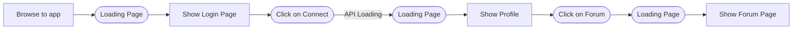
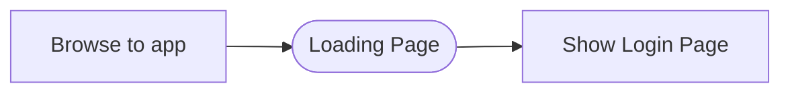
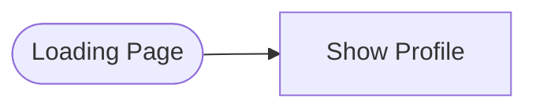

# Les SLOs démystifiés

# De quoi parle-t-on ?

La première question qui nous vient, à ce moment précis, est : A quoi faisons-nous référence ?

Les SLO, pour Service Level Objective correspondent à un objectif de service admissible concernant une application et est relatif à de nombreux indicateurs spécifiques, les SLI. Bien que n’ayant aucune valeur contractuelle, ceux-ci permettront de définir une qualité de service attendue en interne sans pour autant être exposée aux utilisateurs finaux.

Les SLI, quant à eux, ne sont que les métriques qui peuvent être suivies à l’aide d”outils de métrologie ou d’observabilité, tels que :

* **Splunk,**
* **Prometheus/Grafana,**
* **New Relic,**
* **Elastic Stack,**
* **Datadog**

Le plus important est le choix des indicateurs correspondant à l’état de santé de l’application.

Un exemple que l’on pourrait donner est la disponibilité de l’application, à savoir les codes de retour HTTP.

Les codes 20* sont considérés comme OK à l’inverse des codes 4** et 5**.

Cet indicateur impacte l’expérience utilisateur d’un site et peut rendre celle-ci impossible si elle est trop souvent indisponible.

Revenons aux SLO, en reprenant l’exemple de l’indicateur de disponibilité, le SLO qui lui serait lié pourrait être une disponibilité à 99,99%.

Étant la clé de voûte de la gestion du changement chez les SRE de Google. Les dépassements de **SLO**s (dans le sens ou la ***valeur de l’indicateur descend trop longtemps en dessous d’un certain seuil***) seraient considérés comme des incidents et, pour y remédier, des actions de remédiation seraient mises en place.

***Pour rappel*** :

L’approche des *SRE* explique qu’il est impossible de gérer un service correctement sans comprendre les comportements qui importent pour le service. Cela passe par une capacité à les mesurer et les évaluer. Et c’est ce qui nous permettra, à la fin, de délivrer un niveau de qualité qui répond aux attentes des utilisateurs finaux.

La dernière clé de voûte est les SLA, pour Service Level Agreement, il s’agit du niveau d’attente contractuelle avec l’utilisateur final. Celui-ci est la représentation contractuelle du SLO.

Les différentes pierres angulaires relatives à l’approche SRE sont enfin expliquées, passons à la méthodologie de leur mise en application, celle-ci se compose de plusieurs étapes cruciales que nous allons détailler.

# Le contexte

La toute première étape consiste à identifier les utilisateurs principaux de l’application et à recueillir leurs attentes en termes de performances, de disponibilité et de fiabilité.

Par exemple, qui sont les utilisateurs finaux et comprendre leur parcours sur l’application afin de déterminer quelles seraient les métriques les plus pertinentes ou les flux de données les plus sensibles.

Cependant tous les utilisateurs n’ont pas les mêmes exigences en matière de performance et de fiabilité, ce sera à ce moment-là qu'il conviendra de segmenter leurs attentes en fonction de trois catégories :

* **Critique (Must-Have)** : Fonctionnalités essentielles (paiement, authentification).
* **Importante (Nice-to-Have)** : Optimisation de l’expérience utilisateur (rapidité de recherche).
* **Secondaire** : Fonctionnalités annexes (ex. : personnalisation, recommandations).

Le troisième point à prendre en compte sera l’impact que les pannes pourraient avoir sur l’expérience utilisateur, également en fonction de trois critères :

* **Performance dégradée** : Si l'application est plus lente, est-ce un problème critique ou tolérable ?
* **Disponibilité réduite** : Est-ce que certaines fonctionnalités peuvent être indisponibles temporairement ?
* **Expérience utilisateur affectée** : La lenteur ou les erreurs affectent-elles le taux de conversion ou la fidélisation ?

Cartographier l’expérience utilisateur peut être d’un grand secours dans ce cas là, car chaque étape peut être associée à des indicateurs critiques, par exemple :

* Le **délai de réactivité d’une action** (clic sur un bouton)
* Le **temps de chargement** d’une page
* La **disponibilité **d’une page

# Logs et métriques

A cette étape-là, nous pouvons nous pencher sur les indicateurs, à savoir les logs et les métriques sur lesquelles nous devons nous concentrer. L’exemple de parcours utilisateur présenté ci-dessus nous sera très utile car, découpé en plusieurs étapes clés, il nous permettra de mettre en lumière les indicateurs les plus utiles.

## Pré-processing des métriques

Bien qu’il soit tout à fait possible de définir des objectifs à partir d’indicateurs bruts, il est souvent préférable d’effectuer un pré-processing afin d’améliorer la précision et la fiabilité, d’éviter de traiter une trop grande quantité de données et, dans la mesure du possible, de détecter et corriger les anomalies en avance de phase.

La plupart des outils du marché (même Prometheus) permettent d’effectuer ce type de tâche :

<table>
  <tr>
   <td><strong>Outils</strong>
   </td>
   <td><strong>Avantages</strong>
   </td>
   <td><strong>Inconvénients</strong>
   </td>
  </tr>
  <tr>
   <td><strong>Splunk</strong>
   </td>
   <td>Très puissant pour analyser des logs et métriques, langage SPL avancé
   </td>
   <td>Payant et coûteux pour les gros volumes
   </td>
  </tr>
  <tr>
   <td><strong>Prometheus</strong>
   </td>
   <td>Idéal pour les métriques temps réel, puissant avec PromQL
   </td>
   <td>Moins adapté aux logs, nécessite des exporters
   </td>
  </tr>
  <tr>
   <td><strong>Elastic Stack (Elasticsearch, Logstash, Kibana)</strong>
   </td>
   <td>Combine logs et métriques, Logstash permet un bon pré-processing
   </td>
   <td>Peut être complexe à configurer
   </td>
  </tr>
  <tr>
   <td><strong>Datadog</strong>
   </td>
   <td>Interface intuitive, gestion centralisée des logs/métriques/traces, filtrage et agrégation avancés via la query DSL
   </td>
   <td>Payant et peut devenir coûteux à grande échelle
   </td>
  </tr>
  <tr>
   <td><strong>Grafana Loki</strong>
   </td>
   <td>Optimisé pour les logs avec une interface type Prometheus, faible coût
   </td>
   <td>Moins efficace pour les métriques brutes
   </td>
  </tr>
  <tr>
   <td><strong>New Relic</strong>
   </td>
   <td>Monitoring full-stack, APM intégré, requêtes NRQL puissantes
   </td>
   <td>Payant et parfois complexe à configurer
   </td>
  </tr>
</table>

Par contre, ne pas oublier que cela ne fonctionne que sur les métriques et non sur les logs…Cependant, à part pour **Prometheus **et **Grafana Loki**, tous permettent de générer relativement facilement des métriques à partir des logs.

## Quelle approche ?

Avant de se lancer dans le choix des métriques en vue d’établir des **SLOs**, il est nécessaire d’effectuer un choix entre plusieurs approches des **SLO **:

* **SLO métier**
* **SLO technique**

Dans le cas des **SLOs métier**, on peut opter pour le **Customer Journey** ou **l’expérience utilisateur**.

Par exemple :

## Définir Les indicateurs

### Accès à l’application

A ce niveau là, plusieurs indicateurs vont être pris en compte :

* La disponibilité : Le pourcentage de code retour 200 par rapport aux 400 et 500
* Le temps de chargement de la page

### Connexion de l’utilisateur

A cette étape, nous allons observer :

* Le temps de réaction de l’action
* Le temps de chargement de l’API

### Affichage du profil

A l’instar de la première étape, nous observerons les indicateurs de disponibilité ainsi que le temps de chargement.

### Affichage du forum

Ainsi qu’à cette étape, en plus du temps de réaction de l’action.

Au final nous allons devoir réaliser un tableau de bord comprenant 9 indicateurs. Mais ce n’est pas tout

# Fixer les objectifs

## La normalité ?

Maintenant que les métriques sont identifiées, nous allons pouvoir faire un peu de magie appelée “Observabilité”, c’est-à-dire transformer les métriques brutes en métriques exploitables qui serviront de **SLO** via des paliers pour un groupe de métriques, afin de présenter les *zones de danger* à ne pas dépasser.

Ces paliers devront être :

* Orientés métier,
* Correspondre au niveau de qualité attendue par les utilisateurs

Par conséquent, il est fortement recommandé de les définir en collaboration avec les *products owners* afin de coller au plus près des attentes clients.

Quelques bonnes pratiques venant du livre ***Site Reliability Engineering*** :

* Pensez aux objectifs comme ce qu'ils devraient être
* Garder les SLO simples et en petite quantité
* La scalabilité ne peut être infinie (même sur le Cloud)
* Des paliers progressif

## Comportements et réactions

Maintenant que nos **SLI**s et **SLO**s sont définis, que se passe-t-il en cas de dépassement de ceux-ci ?

Si il n’y a aucun moyen mis-en-oeuvre pour connaître l’état des métriques autrement qu’en vérifiant périodiquement sur le tableau de bord, quand bien même ce dernier serait très bien réalisé…alors la démarche en elle-même n’aura servi à rien.

L’idéal serait de pouvoir être informé en temps réel en cas de comportement exotique et, dans la mesure du possible, de pouvoir réagir de manière automatique (mais c’est un sujet complètement différent qui ne sera pas abordé dans cet article).

Par conséquent, à l’aide d’un système d’alerting, lorsque la métrique dépasse un certain seuil, une alerte sera envoyée :

* via un message automatique sur un canal bien défini (**Slack, RocketChat, Teams, Google Chat**, etc…) ou
* envoyer un mail
* envoyer un SMS
* Ou pour les plus anciens : une notification sur un pager

# Une histoire de crédit et de consommation

Dans le cas d’une démarche autour des SLO, il nous reste deux éléments indispensables à évoquer :

* Error Budget
* Burn Rate

Ce sont les deux concepts clés dans la gestion des **SLO (Service Level Objectives)** pour assurer un bon équilibre entre la **fiabilité** et la **vélocité des développements**.

## Error Budget

L'**Error Budget** (ou **budget d’erreur**) représente la **marge d’erreur acceptable** avant de dépasser un **SLO**. C’est le "crédit" d’erreur qu’un service peut "dépenser" tout en respectant ses engagements.

## Burn Rate

Le **Burn Rate** mesure **la vitesse à laquelle on consomme l’Error Budget**.

C'est un indicateur essentiel pour anticiper les risques et ajuster les actions.

Ces deux indicateurs sont extrêmement importants pour plusieurs raisons.

L’error Budget permet d’**équilibrer innovation et stabilité. **Par exemple, s’il est consommé trop rapidement, on peut **ralentir les déploiements** pour améliorer la fiabilité.

A l’inverse, on peut **prendre plus de risques**, comme accélérer les releases s’il est sous-utilisé.

Quant au Burn Rate, Selon qu’il soit inférieur ou supérieur à 1, cela indique la vitesse (faible ou trop rapide) à laquelle l’**Error Budget** est consommé.

## Comment les utiliser ensemble ?

<table>
  <tr>
   <td><strong>Situation</strong>
   </td>
   <td><strong>Error Budget restant</strong>
   </td>
   <td><strong>Burn Rate</strong>
   </td>
   <td><strong>Actions recommandées</strong>
   </td>
  </tr>
  <tr>
   <td>🚀 <strong>Tout va bien</strong>
   </td>
   <td>> 50%
   </td>
   <td>&lt; 0.5
   </td>
   <td>Possibilité d’accélérer les déploiements et les expérimentations
   </td>
  </tr>
  <tr>
   <td>⚠️ <strong>Surveillance requise</strong>
   </td>
   <td>25-50%
   </td>
   <td>0.5 - 1
   </td>
   <td>Continuer à monitorer, possible ajustement des releases
   </td>
  </tr>
  <tr>
   <td>🛑 <strong>Risque de dépassement</strong>
   </td>
   <td>&lt; 25%
   </td>
   <td>1 - 2
   </td>
   <td>Ralentir les releases, prioriser la stabilité
   </td>
  </tr>
  <tr>
   <td>🔥 <strong>Violation imminente</strong>
   </td>
   <td>0%
   </td>
   <td>> 2
   </td>
   <td>Freeze des déploiements, correction des problèmes urgents
   </td>
  </tr>
</table>

Ceci est un exemple d’implémentation.

# Pour aller plus loin

Nos indicateurs et nos objectifs sont maintenant clairement définis, il ne manque que le contrat à passer avec les équipes en charge des produits pour lesquels la démarche SLO a été engagée. Cela reste une affaire de communication et de documentation.

Nous pourrions également revenir sur un point évoqué dans cet article, au niveau des comportements et des réactions, à savoir la réaction automatique ou l’auto-remédiation.

Dernier point que l’on pourrait aborder ici, il s’agit des post-mortem d’incidents liés aux SLOs, actions qui permettraient de comprendre les causes exactes afin d’éviter des dépassements trop importants de SLOs à l’avenir.
